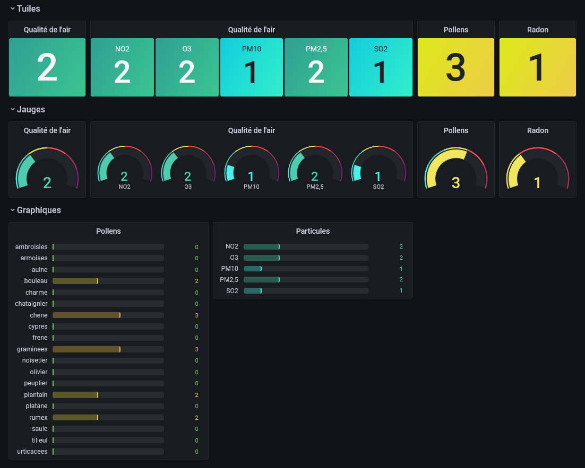

# recosante_exporter

Polls data from [Recosanté](ttps://recosante.beta.gouv.fr/) and stores them into Prometheus.
Collected data can be displayed on a Grafana dashboard.

## Quickstart

Commands to start the exporter:
```sh
git clone https://github.com/antoinbo/recosante_exporter.git
cd recosante_exporter
docker-compose up -d
```

Prometheus configuration to scrape the exported values:
```yaml
scrape_configs:

  - job_name: json_exporter
    static_configs:
      - targets: ["recosante_exporter:7979"]

  - job_name: recosante_exporter
    scrape_interval: 6h
    metrics_path: /probe
    params:
      target: ["https://api.recosante.beta.gouv.fr/v1/?insee=75056&show_raep=true&show_indice_uv=true"]
    static_configs:
      - targets: ["recosante_exporter:7979"]
```

The `insee` argument must be replaced by your own city code (French cities only).
It can be found in the URL: https://api.recosante.beta.gouv.fr/v1/?insee=**<75056>**&show_raep=true&show_indice_uv=true

The following API can be called to retrieve your city's Insee code:
```sh
curl -s "https://geo.api.gouv.fr/communes?&boost=population&limit=10&fields=nom,code&nom=Paris" | jq '.[] | [.code, .nom] | join(" <-- ")'
# "75056 <-- Paris"
# "81202 <-- Parisot"
# "82137 <-- Parisot"
# "95176 <-- Cormeilles-en-Parisis"
# "38485 <-- Seyssinet-Pariset"
# "95241 <-- Fontenay-en-Parisis"
# "71343 <-- Paris-l'Hôpital"
# "62826 <-- Le Touquet-Paris-Plage"
```

## Demo with Prometheus + Grafana

This example is meant to setup a quick environment to test the project, it is not secured and it must not be used in production without a proper security configuration.

Commands to start the demo:
```sh
git clone https://github.com/antoinbo/recosante_exporter.git
cd recosante_exporter/examples
docker-compose up -d
```

Open the Grafana console on your web browser: https://localhost:3000/



Command to end the demo:
```sh
docker-compose down
```
